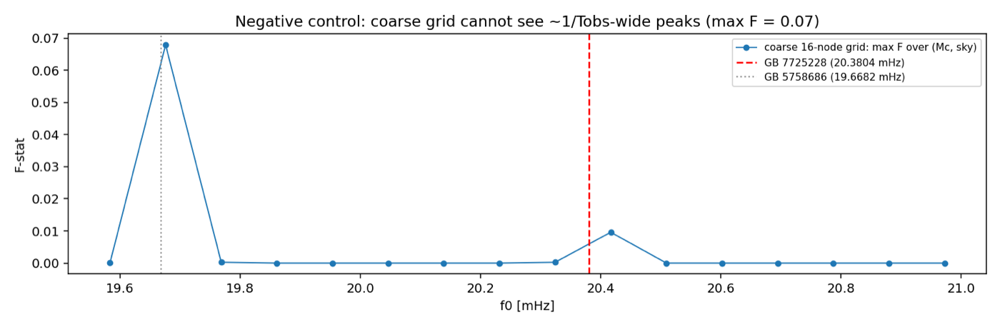
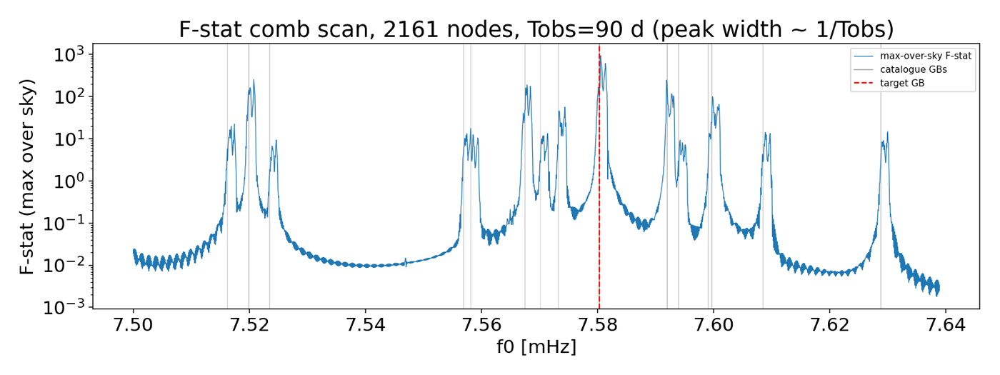
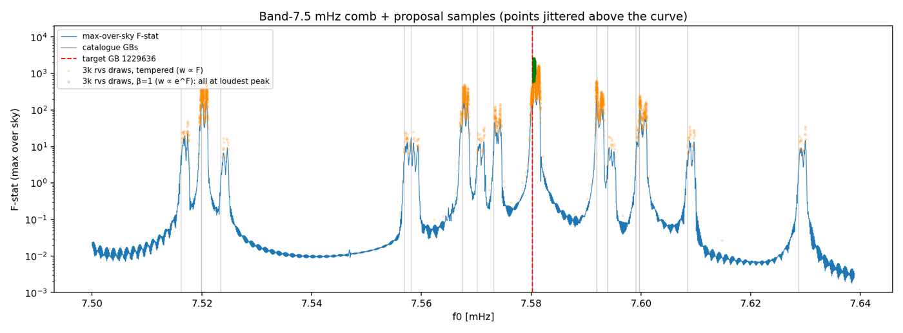
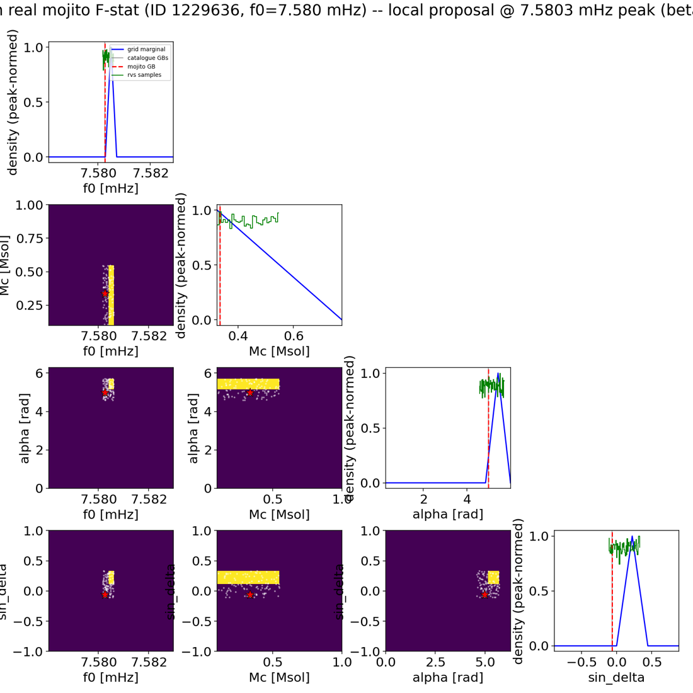
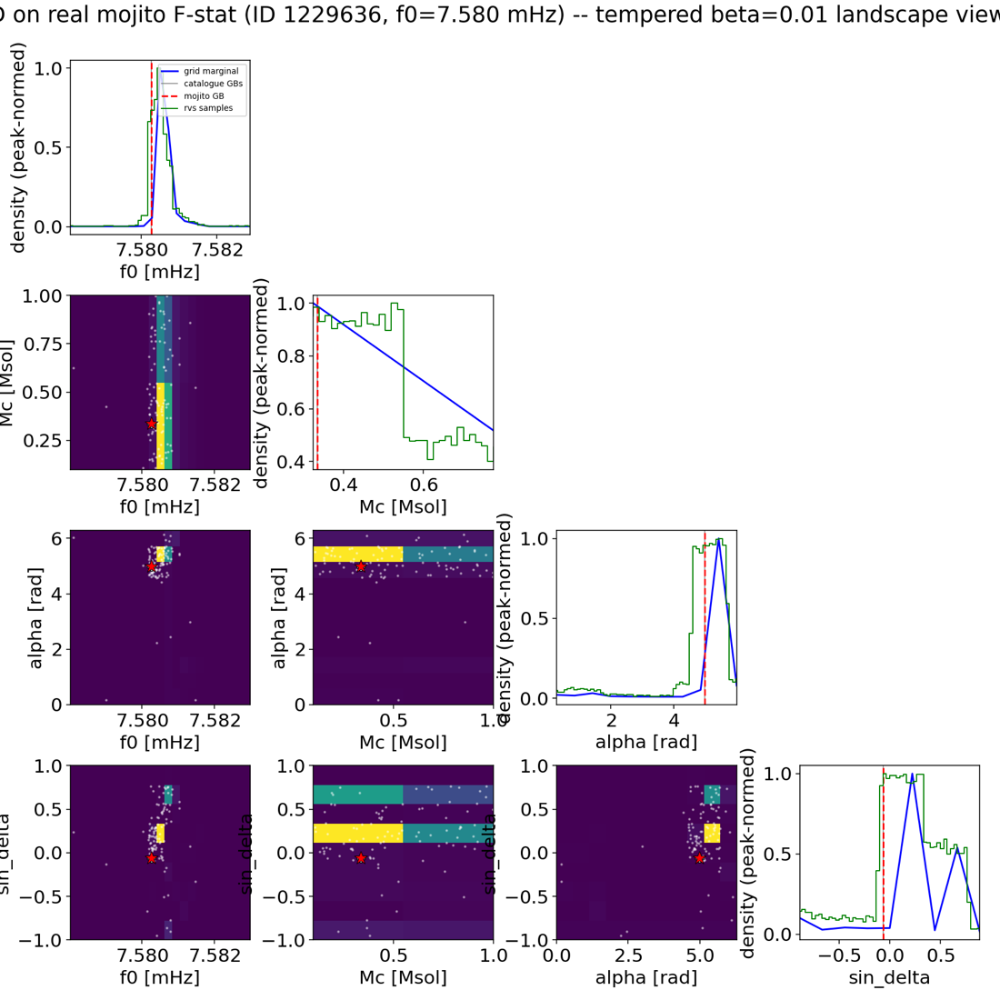
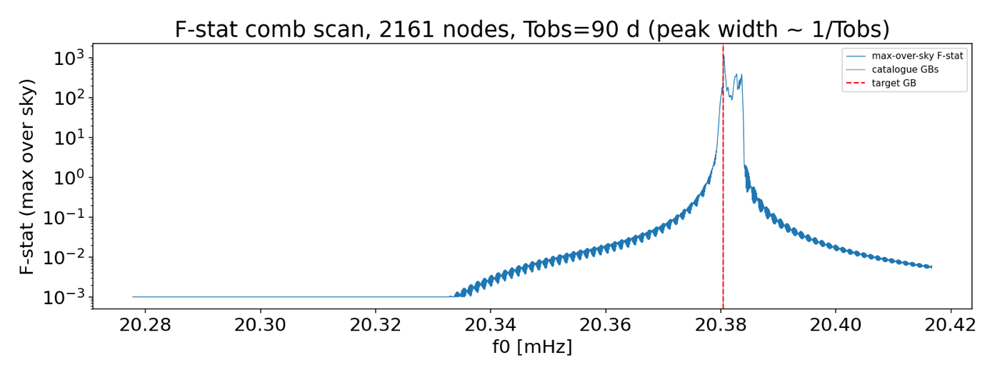
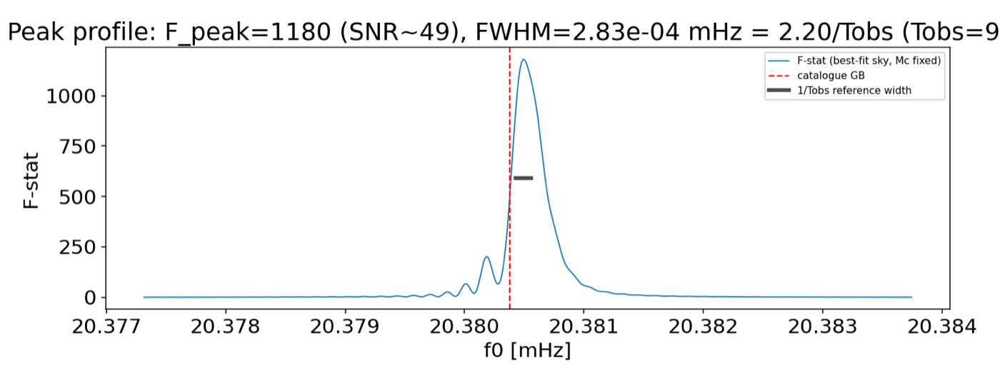
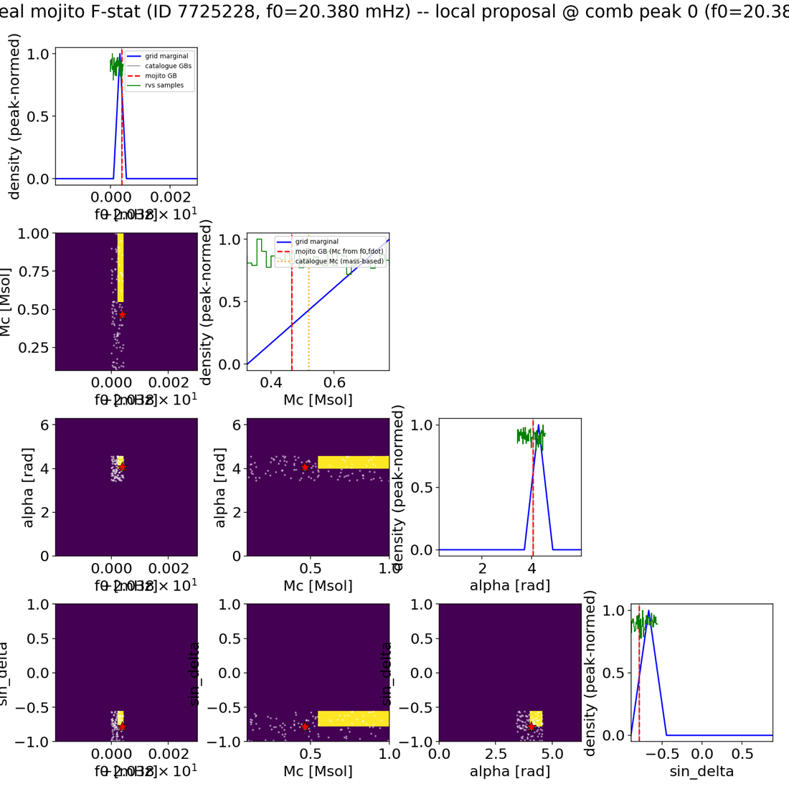

# The GB F-statistic proposal (`FStatProposal4D`)

*Tutorial + validation record, 2026-07-15. Code:
[`lisatools/sampling/fstat_proposal.py`](../../src/lisatools/sampling/fstat_proposal.py);
tests: `tests/test_fstat_proposal.py`; runner scripts:
[`scripts/fstat_proposal/`](../../scripts/fstat_proposal/).*

`FStatProposal4D` turns batched GB **F-statistic** evaluations over a
sub-band into an eryn-compatible proposal distribution
(`rvs(size)` / `logpdf(x)`) over the 4 intrinsic sampling parameters

```
theta = (f0 [mHz], Mc [Msol], alpha [rad], sin_delta)
```

with the target density `p(θ) ∝ exp(β·F(θ))`. The F-stat
(`F = ½ NᵀM⁻¹N` from `chunked_het.get_fstat_ll_wdm`) is the likelihood
analytically maximized over the 4 extrinsics (A, ι, ψ, φ0), so one number per
point says "how much source is here" regardless of orientation. `β` is an
inverse-temperature knob: `β=1` is likelihood-shaped (≈ the intrinsic
posterior under a flat prior), `β<1` broadens for MCMC acceptance.

## Quick usage

```python
from lisatools.sampling.fstat_proposal import FStatProposal4D, GridSpec

grid = GridSpec(
    f0_range=(7.578, 7.583),      # mHz
    Mc_range=(0.1, 1.0),          # Msol
    alpha_range=(0.0, 2 * np.pi),
    sin_delta_range=(-1.0, 1.0),
    n_f0=24, n_Mc=3, n_alpha=12, n_sin_delta=10,
)
prop = FStatProposal4D(gb_wdm_comp, wdm_holder, grid, beta=1.0)

draws = prop.rvs(size=(10_000,))       # (10000, 4), exact inverse-CDF draws
logq  = prop.logpdf(draws)             # normalized; -inf outside the box

# register in an eryn prior/proposal container under a tuple key:
# ProbDistContainer({("f0", "Mc", "alpha", "sin_delta"): prop, ...})

# rebuild from a cached grid without re-sweeping the kernel:
clone = FStatProposal4D.from_grid(prop._axes, prop._logp_grid)
```

`gb_wdm_comp` is a `gbgpu.gbcomps.GBWDMComputations`; `wdm_holder` the
`AnalysisContainerArray` holding the WDM residual + inverse covariance.
Construction sweeps the grid in batched `get_fstat_ll_wdm` calls; the
density is piecewise-constant on cells with **corner-averaged (trapezoid)
weights**, which makes `rvs`/`logpdf` exactly self-consistent and removes
the +dx/2 mean bias a lower-corner histogram carries.

The end-to-end demo (stock `gb_no_fg` on the mojito GB brick) is
`scripts/fstat_proposal/plot_fstat_proposal_mojito.py` — see its docstring
for every knob. The runs below used **injection-only data (no noise
realization)** whitened by the **tabulated empirical PSD from the mojito
NOISE brick** (`MojitoNoiseEstimates`, extras-only fixed-PSD path).

## The one design fact that matters: peaks are ~1/Tobs wide

With `Tobs = 90 d`, an F-stat peak in f0 is ~1.3e-4 mHz wide. No feasible
4-D tensor grid resolves that: the coarse 16-node "locate" grid over the
20.38 mHz band returned **max F = 0.07 with a flat density** — it never
landed within a correlation length of a genuinely loud source
(the measured negative control, kept in the runner as `FSTAT_DESIGN=coarse`):



Two physical facts fix the design (`FSTAT_DESIGN=comb`, the default):

1. `fdot·Tobs ≈ 1e-8 Hz ≪ 1/Tobs` → **Mc is nearly unmeasurable per band**;
   hold it fixed while scanning.
2. Sky enters mainly through the Doppler ridge (peak f0 shifts up to
   ±f0·v/c ≈ ±2e-3 mHz) → a handful of sky points suffices for detection.

So: a **dense-in-f0 comb scan** (node spacing 1/(2·Tobs), ~2160 nodes per
WDM-layer band interior × 6 golden-spiral sky points, maximized over sky),
then a **local 4-D proposal grid** around each top peak.

## Result 1 — the crowded ~7.5 mHz band: every peak is a catalogue source

Stock `gb_no_fg` band, interior [7.500, 7.639] mHz, ~15 catalogue sources:



All 10 reported comb peaks match catalogue sources (offsets ≤ 1.2e-3 mHz,
inside the 6-point-sky Doppler smear), with F tracking amplitude and zero
spurious peaks — the floor between sources sits at F ~ 1e-2, five decades
below the loudest peak (F = 936, SNR ≈ 43, the band's loudest source
ID 1229636 at 7.58026 mHz):

| comb peak [mHz] | F | catalogue source | cat f0 [mHz] |
|---|---|---|---|
| 7.58050 | 936 | 1229636 (target) | 7.58026 |
| 7.52077 | 256 | 5669634 | 7.51997 |
| 7.59189 | 246 | 7818763 | 7.59197 |
| 7.56784 | 190 | 12762817 (fdot<0!) | 7.56749 |
| 7.59979 | 99  | 15533363 + 8759934 (blend) | 7.5997 / 7.5991 |
| 7.57433 | 56  | 10868282 | 7.57321 |
| 7.51743 | 22  | 13202360 | 7.51626 |
| 7.55813 | 18  | 13889464 / 9637217 | 7.5582 / 7.5569 |
| 7.62995 | 15  | 11791432 | 7.62875 |
| 7.60886 | 14  | 1909642 | 7.60848 |

Note the fdot<0 interacting binary found through a fixed-Mc template — the
1/Tobs frequency resolution simply doesn't care about fdot at 90 d.

Drawing from the proposal and overlaying the draws on the comb shows the two
operating modes: at `β=1` **100% of draws land on the loudest peak** (the
correct RJ-birth behavior: propose the loudest unmodeled source), while a
tempered weighting spreads draws across every peak ∝ its F:



## Result 2 — the local 4-D proposal is posterior-located

A 24×3×12×10 grid over ±2.5e-3 mHz around the top comb peak
(8,640 F-stat evaluations):

- argmax cell: `f0 = 7.5804` (true 7.58026; cell 2.2e-4 mHz),
  sky within one cell on both axes, `F_peak = 1117` (SNR ≈ 47);
- at `β=1` the whole proposal mass sits in the **single cell containing the
  injection** (`logpdf(injection) = 9.217 =` the sampled maximum);
- the Mc axis is flat as predicted (the sample mean still pulls toward the
  true 0.336 — the fdot·T² phase is ~0.3 rad at 90 d, marginally
  informative).

Corner of the sampled distribution with the truth marked (β=1, top;
tempered β=0.01 landscape view, bottom — the sky panel shows the usual
antenna-pattern reflection as a secondary mode):




## Result 3 — the highest-frequency source: one single, very tight peak

ID 7725228 at f0 = 20.380377 mHz — the highest-frequency GB in the
catalogue, isolated by 0.71 mHz. The same comb + profile recipe over a
3-layer band shows exactly one peak: the comb's top entry is
`f0 = 20.38053 mHz, F = 1139` (SNR ≈ 48); the runner-up (F = 393 at
+3.1e-3 mHz) is the *same source's* Doppler-ridge image at a neighboring
sky point, and everything else sits at the F ≲ 0.7 floor. The ultra-dense
profile scan (spacing 1/(10·Tobs), best-fit sky) measures the peak width
directly: **FWHM = 2.83e-4 mHz = 2.2/Tobs** at `F_peak = 1180` — a
matched-filter-limited line, ~500× narrower than even this 3-layer band,
with the classic sinc sidelobe ringing on the flank:





**Chirp-mass caveat for this source**: the mojito DWD catalogue is an
*interacting* population. The highest-f binary has mass-based
Mc = 0.5192 M☉ but its injected (f0, fdot) implies **Mc_eff = 0.4658 M☉**;
since the proposal maps Mc→fdot through the GW-only relation
(`gbgpu.utils.utility.get_fdot`), the F-stat peaks at Mc_eff. Plots mark
both values. (For the 7.5 mHz-band sources the two agree to ~1e-4.)

## Verification summary

| step | check | result |
|---|---|---|
| `compute_fstat` | vs direct matrix inverse (SPD Gram); singular-safe | 1e-6; no raise |
| chirp-mass basis | forward exact; inverse round-trip; pickle | 4e-15; pass |
| density build | trapezoid cells remove +dx/2 mean bias | measured, removed |
| `rvs` | mock-Gaussian moments; marginals overlap ([plot](img/mock_zoom.png)) | 0.1σ / 10% |
| `logpdf` | MC ∫=1; rvs/logpdf entropy consistency; −inf outside | 5% / 2% |
| real data (band75) | 10/10 comb peaks = catalogue sources | pass |
| real data (peak fit) | all 4 params within one grid cell of truth; logpdf@truth = max | pass |
| unit tests | `tests/test_fstat_proposal.py` | 12/12 |

Bugs found and fixed during verification:

- **gbgpu `get_fdot` mutated the caller's Mc array in place**
  (`Mc *= MSUN_SI`) — corrupted any live parameter array passed as `Mc=`.
- gb.py's phi0-flip lambdas made the stock GB transform container
  unpicklable → named `transforms.negate`.
- Half-cell `imshow` extent bug in the corner plots.
- The original mojito runner's unconditional slab-args monkey-patch breaks
  current GBGPU builds → probe-based conditional patch.

## Next steps

- **Fisher/Laplace refinement per peak** (`chunked_het.information_matrix`,
  ~40 kernel evals/peak) → Gaussian(s) → `FullGaussianMixtureModel`; removes
  the grid-cell resolution floor (plan §7 of
  `scripts/fstat_proposal/PLAN_scattered_field_distributions.md`).
- GPU sweep (one batched kernel launch replaces the ~170 ms/eval CPU cost
  that shaped the grid budgets here).
- The astrophysical (f0, Mc) GMM prior
  (`lisatools.sampling.f0_mchirp_prior.F0McGMMSampling`) is referenced by the
  stock GB setup behind `GB_F0MC_GMM_PRIOR=1` but the module still lives
  only on the other dev machine — push it before enabling that flag.
